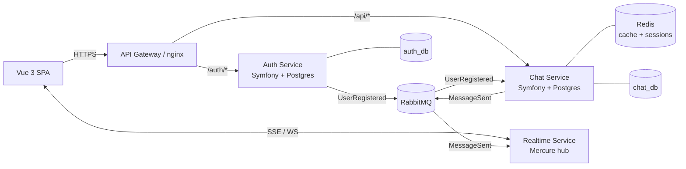

# Telegram Clone — MVP Plan

> **Purpose:** Educational / practice project. Focus is on getting the architecture right and shipping a working slice end-to-end, **not** on feature parity with Telegram.

---

## 1. Confirmed Decisions

- **Web only for MVP.** Mobile client is a long-term goal — design APIs to be client-agnostic from day one.
- **Text messages only** for v1. No media, voice, video, stickers, E2E.
- **1-on-1 chats only** for v1. Schema must accommodate group chats so v2 needs no migration (see §8).
- **Real-time delivery is in scope.**
- **No presence / last-seen for v1.** Deferred to v2.
- **English only.** i18n deferred to long term.
- **Monorepo**, one Git repo, independent services per subdirectory — see §2 for layout.
- **Two separate Postgres containers** — one per service. Real microservice topology.
- **nginx as the API gateway** for the entire MVP.
- **Email is private** (used for login only). **Username is public** (display + search).
- **Mercure for realtime** — see §9 for the WebSockets tradeoff and migration story.

---

## 2. Repository Layout (Monorepo)

One Git repo. Each service is a fully independent project — its own `composer.json`, dependencies, `Dockerfile`, tests, and migrations. They communicate **only** over the network (HTTP + RabbitMQ). The repo is just a coordination layer; nothing is shared at the code level except possibly a tiny `contracts/` directory for event payload schemas (optional).

```
telegram-clone/
├── docker-compose.yml          # orchestrates everything for local dev
├── .env.example
├── .github/workflows/          # one CI job per service, run in parallel
├── nginx/
│   └── nginx.conf              # API gateway routing
├── services/
│   ├── auth/                   # independent Symfony app
│   │   ├── composer.json
│   │   ├── Dockerfile
│   │   ├── src/
│   │   ├── tests/
│   │   ├── config/
│   │   └── migrations/
│   ├── chat/                   # independent Symfony app
│   │   ├── composer.json
│   │   ├── Dockerfile
│   │   └── ...
│   └── realtime/               # Symfony worker (consumes RabbitMQ → publishes to Mercure)
│       ├── composer.json
│       ├── Dockerfile
│       └── ...
├── web/                        # Vue 3 SPA
│   ├── package.json
│   └── src/
├── contracts/                  # OPTIONAL: shared event schemas (JSON Schema or PHP DTOs)
│   └── events/
│       ├── UserRegistered.json
│       └── MessageSent.json
└── README.md
```

**Why this is genuinely microservice, not a monolith in disguise:**
- Each service has its own `composer.json` and dependencies. No shared autoload.
- Each service has its own database. No shared schema.
- Services never `use` classes from another service. Events crossing the boundary are POPOs serialized to JSON.
- Each service can be deployed independently. The monorepo is purely for dev convenience.

**Splitting later:** if you ever want one service in its own repo, `git subtree split --prefix=services/auth` produces a clean repo with full history. Mechanical, low-risk.

---

## 3. Scope

### In scope
- User registration & login (email + password, JWT-based).
- User search by username.
- Create/open 1-on-1 chat.
- Send & receive text messages with real-time delivery.
- Message history with pagination.
- Vue 3 SPA consuming the APIs.
- Dockerized local environment.

### Out of scope (defer to v2+)
- Group chats — **schema ready, feature deferred**.
- Presence / last-seen / typing indicators.
- Media/file uploads.
- Voice/video, stickers, reactions.
- End-to-end encryption.
- Push notifications, email notifications.
- Read receipts.
- Message editing/deletion.
- Mobile clients.
- Production deployment, K8s, CI/CD beyond a basic GitHub Actions pipeline.

---

## 4. Architecture Overview

### V1 services

| Service | Stack | Responsibility |
|---|---|---|
| **API Gateway** | nginx | TLS termination, path-based routing (`/auth/*` → Auth, `/api/*` → Chat), CORS, static frontend hosting |
| **Auth Service** | Symfony 7 + Postgres | Registration, login, JWT issuance & refresh, password hashing |
| **Chat Service** | Symfony 7 + Postgres | Users (read projection), chats, messages, history. Owns the business domain. |
| **Realtime Service** | Symfony worker + Mercure hub | Consumes `MessageSent` from RabbitMQ, publishes to recipient's Mercure topic |
| **Message Broker** | RabbitMQ | Async events between services |

### Why these four and not more

You asked for **minimum** microservices with a real architectural split. This gives you:
- A real **auth boundary** (swappable to OAuth/SSO later without touching business logic).
- A real **async boundary** via RabbitMQ.
- A real **realtime boundary** with a different runtime profile (long-lived connections vs short HTTP).

Anything else (Media, Notifications, Presence) is deferred until there's a concrete v2 feature requiring it.

### Diagram



---

## 5. Tech Stack

| Layer | Choice | Notes |
|---|---|---|
| Backend framework | **Symfony 7.x** | LTS-track, current stable. |
| PHP | **8.3+** | Readonly classes, enums, DTOs are nicer here. |
| Database | **PostgreSQL 16** | One DB per service, two separate containers. |
| ORM | **Doctrine ORM 3.x** | Standard with Symfony. |
| Messaging | **Symfony Messenger** + **RabbitMQ** | Command bus, query bus, async event transport. |
| Realtime | **Mercure** | See §9 for the rationale and the WebSockets migration story. |
| Cache / sessions | **Redis 7** | One container, shared by services for cache and Messenger sync transport in dev. |
| Auth tokens | **JWT (RS256)** | Auth signs with private key; Chat verifies with public key — no service-to-service call needed for verification. Use `lexik/jwt-authentication-bundle`. |
| Frontend | **Vue 3** + Composition API + `<script setup>` | |
| Frontend state | **Pinia** | |
| Frontend build | **Vite** | |
| Frontend HTTP | **Axios** or native `fetch` | |
| Frontend realtime | **`EventSource`** (native browser API for SSE) | |
| Tests (BE) | **PHPUnit** + **Behat** for acceptance | Behat pairs really well with DDD use cases. |
| Tests (FE) | **Vitest** + **Vue Test Utils**, **Playwright** for e2e | |
| Container | **Docker** + **docker-compose** | |
| Reverse proxy / API gateway | **nginx** | Throughout MVP. |
| Code quality | PHPStan (level 8), PHP-CS-Fixer, Rector, ESLint, Prettier | |

---

## 6. Domain Model (DDD)

Bounded contexts and the bundles that implement them:

### Auth Service — bounded context: Identity

```
services/auth/
  src/
    Identity/
      Domain/
        Model/           User, HashedPassword, Email, UserId
        Repository/      UserRepositoryInterface
        Event/           UserRegistered, UserLoggedIn
        Exception/
      Application/
        Command/         RegisterUser, RefreshToken, RevokeToken
        Query/           (rare here; auth is mostly write-side)
        Handler/
        Service/         PasswordHasher, TokenIssuer
      Infrastructure/
        Persistence/Doctrine/    UserRepository, mappings
        Http/Controller/         RegisterController, LoginController
        Symfony/                 DI config, security config
```

### Chat Service — bounded contexts: User, Chat, Message

Inside **one** Symfony app, three bundles / contexts:

```
services/chat/
  src/
    User/                # local read-side projection of identity
      Domain/            UserProfile, Username
      Application/       SearchUsers (query), SyncUserFromAuth (command)
      Infrastructure/
    Chat/
      Domain/            Chat, ChatId, Participant, ChatType
      Application/
        Command/         CreateDirectChat
        Query/           ListUserChats, GetChatById
        Handler/
      Infrastructure/
    Message/
      Domain/            Message, MessageId, MessageContent, SentAt
      Application/
        Command/         SendMessage
        Query/           GetChatHistory
        Handler/
      Infrastructure/
    Shared/              # only truly cross-cutting stuff: ids, clocks, base classes
      Domain/
      Infrastructure/
```

> **Rule of thumb:** if it's only used by one context, it stays in that context. `Shared/` should stay tiny.

---

## 7. CQRS Strategy

Use **Symfony Messenger** with **two separate buses**: `command.bus` and `query.bus`. Don't do event sourcing — overkill for MVP.

| Operation | Side | Why CQRS pays off |
|---|---|---|
| `RegisterUser`, `SendMessage`, `CreateDirectChat` | Command | Validation + domain invariants + persistence + emit event. |
| `GetChatHistory` (paginated) | Query | Skip Doctrine entity hydration — return DTOs directly via DBAL for speed. |
| `ListUserChats` with last message + unread count | Query | Classic case where a denormalized read model wins. For MVP, do it with a tuned SQL query; introduce a materialized read table only if performance forces it. |
| `SearchUsers` | Query | Same — pure read, no need for entity graph. |

Folder convention inside each context:
```
Application/
  Command/   <- DTOs (immutable, validated)
  Query/     <- DTOs
  Handler/   <- One handler per command/query, with #[AsMessageHandler] attribute
```

Domain events are dispatched **after** the transaction commits, via `Symfony\Contracts\EventDispatcher` for in-process listeners and via RabbitMQ for cross-service consumers.

---

## 8. Inter-Service Communication

| Direction | Mechanism | Examples |
|---|---|---|
| Browser → backend | HTTPS via API Gateway | Login, send message, fetch history |
| Browser ← backend (push) | SSE via Mercure | New incoming message |
| Auth → Chat (async) | RabbitMQ event `UserRegistered` | Chat creates a local `UserProfile` projection |
| Chat → Realtime (async) | RabbitMQ event `MessageSent` | Realtime worker publishes to recipient's Mercure topic |
| Chat → Auth (sync) | **None for MVP.** JWT verification is local (public key). | n/a |

**RabbitMQ in V1 — only two events:**

```
UserRegistered { userId, username, registeredAt }
  publisher: Auth Service (after successful registration)
  consumer:  Chat Service → creates row in user_profiles

MessageSent { messageId, chatId, senderId, recipientIds[], content, sentAt }
  publisher: Chat Service (after successful POST /api/chats/{id}/messages)
  consumer:  Realtime Service → publishes to Mercure topic /users/{recipientId}
```

That's the entire async surface for V1. Could you replace these with HTTP calls? Yes. The reason not to: with the broker, Auth doesn't care if Chat is up when someone registers, and Chat doesn't care if Realtime is up when someone sends a message. Failures buffer instead of cascade. **That decoupling is the pattern worth learning** — it's why microservices with sync chains usually end up worse than the monolith they replaced.

**JWT flow:**
1. Auth signs JWT with RS256 private key.
2. Public key is shared with Chat (env var or mounted volume).
3. Chat verifies signature locally on every request — no network call.
4. Token claims include `sub` (user id) and `username`. That's all Chat needs.

---

## 9. Database Strategy

- **Auth Service**: own DB in its own Postgres container (`auth_db`). Tables: `users`, `refresh_tokens`.
- **Chat Service**: own DB in its own Postgres container (`chat_db`). Tables: `user_profiles` (projection), `chats`, `chat_participants`, `messages`.
- **No foreign keys across services.** `user_id` in Chat references the Auth user but is not enforced at DB level. Consistency comes from the `UserRegistered` event handler.
- Migrations: **Doctrine Migrations** per service.
- Use UUIDv7 for ids — sortable, no leakage of insertion order, plays well with distributed systems.

### Group-chat-ready schema

To avoid migrations in v2, model chats as many-to-many from day one even though MVP only creates 2-participant chats:

```
chats
  id            uuid PK
  type          varchar     -- 'direct' for v1, 'group' added later
  title         varchar nullable   -- null for direct chats
  created_at    timestamptz

chat_participants
  chat_id       uuid FK chats(id)
  user_id       uuid        -- references auth's user, no FK
  joined_at     timestamptz
  PK (chat_id, user_id)

messages
  id            uuid PK     -- UUIDv7 → naturally sorted by time
  chat_id       uuid FK chats(id)
  sender_id     uuid        -- references auth's user, no FK
  content       text
  sent_at       timestamptz
  INDEX (chat_id, id)       -- for paginated history
```

For direct (1-on-1) chats: enforce `type = 'direct' → exactly 2 rows in chat_participants` at the application layer, and add a unique partial index to prevent duplicate direct chats between the same two users. Group chats in v2 just relax that invariant.

---

## 10. Realtime Strategy

**Choice: Mercure.**

### Honest tradeoff vs WebSockets

WebSockets are more universally industry standard — real Telegram, WhatsApp, Slack, Discord all use them. Mercure is the Symfony-ecosystem standard, built on SSE (W3C standard), used in production by API Platform and others. It is not exotic, but it is not what FAANG-scale chat uses.

**For this MVP, Mercure wins on:**
- Native Symfony integration via `symfony/mercure-bundle`.
- SSE works through any HTTP proxy without special config.
- Auth via JWT topic claims is built in — no auth handshake to design.
- Hub is a single Go binary in Docker — zero PHP-side connection management.
- Works fine with mobile clients later (SSE is just HTTP).

**Limitation worth knowing:** SSE is server → client only. For client → server you still POST normally. For chat that's perfect; if you later add features like collaborative cursors that need bidirectional low-latency, you'd want WebSockets.

### Migration path if you outgrow it

The realtime layer is a self-contained service with two responsibilities: consume `MessageSent` from RabbitMQ, push to subscribers. Replacing the Mercure hub + worker with a Ratchet/ReactPHP WebSocket server is a contained project — no domain code changes, no DB changes, only the frontend transport (`EventSource` → `WebSocket`) and the realtime service implementation change.

### Flow

1. User logs in → Chat Service issues a Mercure subscriber JWT scoped to topic `/users/{userId}`.
2. Vue opens `EventSource('https://hub/.well-known/mercure?topic=/users/{userId}')` with that JWT.
3. Sender calls `POST /api/chats/{id}/messages`. Chat persists, emits `MessageSent` to RabbitMQ.
4. Realtime worker consumes `MessageSent`, publishes to Mercure topic `/users/{recipientId}`.
5. Recipient's `EventSource` fires `onmessage`. Pinia store appends. UI updates.

---

## 11. Frontend Architecture

```
web/
  src/
    app/                 # router, pinia setup, axios instance
    shared/              # ui kit, http client, types
    features/
      auth/              # login, register pages, useAuth composable
      chat-list/         # sidebar with chats
      chat-room/         # message list + composer
      user-search/       # find user to start chat
    entities/            # Chat, Message, User TS types
    pages/               # LoginPage, ChatPage
```

- **Routing:** Vue Router with auth guard redirecting to `/login`.
- **Auth tokens:** access token in memory (Pinia), refresh token in `httpOnly` cookie.
- **Realtime:** one `EventSource` per session, lives in a `useRealtime` composable, dispatches into Pinia stores.
- **Optimistic UI:** when sending a message, append immediately with `pending` state; replace on server ack.

---

## 12. Docker Setup

`docker-compose.yml` services:

```
- nginx              :80         # API gateway + serves built Vue
- auth-php           :9000       # PHP-FPM (Auth Service)
- chat-php           :9000       # PHP-FPM (Chat Service)
- realtime-php       :9000       # PHP-FPM (Realtime worker)
- auth-postgres      :5432       # dedicated, mapped to host :5433
- chat-postgres      :5432       # dedicated, mapped to host :5434
- redis              :6379
- rabbitmq           :5672  + :15672 management UI
- mercure            :3000
- vue-dev            :5173       # only in dev profile, removed in prod build
```

Use **Docker profiles** to run only what you need (`docker compose --profile dev up`).

Each Symfony service has its own `Dockerfile` (multi-stage: composer install → php-fpm) and its own `Makefile` targets for `up`, `migrate`, `test`, `cs-fix`.

---

## 13. TDD Approach

Layered testing pyramid, written **before** production code per layer:

| Layer | Tool | What you test | TDD cycle |
|---|---|---|---|
| Domain (entities, value objects) | PHPUnit | Invariants, behavior. No framework, no DB. | Red/Green/Refactor on every method. |
| Application (command/query handlers) | PHPUnit | Handlers with in-memory repositories. | Drive handler API from the test. |
| Infrastructure (Doctrine repos) | PHPUnit + real Postgres in Docker | Mappings, queries. | Write integration test, then mapping. |
| HTTP (controllers) | Symfony WebTestCase | Status codes, JSON shape, auth. | Write the contract test first. |
| Acceptance / use-case | Behat (Gherkin) | "User registers, logs in, sends a message to another user." | Drives slice end-to-end. |
| Frontend unit | Vitest | Composables, stores. | |
| Frontend e2e | Playwright | "Two browsers, message appears in real time." | One per flow. |

In-memory repository implementations of domain interfaces are first-class — they make handler tests trivially fast and force a clean port/adapter boundary.

---

## 14. Implementation Phases

Backend-first. Frontend lives entirely in Phase 5 — until then, Postman / `curl` / Behat are your UI.

Each phase ends with **green tests and a working demo**.

### Phase 0 — Bootstrap (1–2 days)
- Monorepo skeleton (see §2): `services/auth`, `services/chat`, `services/realtime`, `nginx/`, root `docker-compose.yml`.
- All infra containers up: nginx, auth-postgres, chat-postgres, redis, rabbitmq, mercure.
- Auth service: Symfony 7 skeleton, `/health` endpoint, PHPUnit + Behat configured and running (1 sample test).
- Chat service: same.
- Realtime service: Symfony skeleton with a stub Messenger consumer.
- GitHub Actions: lint + test on push, one job per service running in parallel.
- **Done when:** `docker compose up` boots the stack, all `/health` endpoints return 200 via nginx, all sample tests pass in CI.

### Phase 1 — Auth Service (2–4 days)
- Domain: `User`, `Email`, `Username`, `HashedPassword`.
- Commands: `RegisterUser`, `LoginUser`, `RefreshToken`.
- HTTP: `POST /auth/register`, `POST /auth/login`, `POST /auth/refresh`.
- Issues JWT (RS256). Refresh tokens persisted.
- Publishes `UserRegistered` to RabbitMQ.
- **Done when:** Behat scenario "I register, then log in, then call a protected endpoint" passes; the `UserRegistered` event is visible in the RabbitMQ management UI.

### Phase 2 — Chat Service: User context (1–2 days)
- Consumes `UserRegistered`, projects to `user_profiles` (id, username only — no email).
- Query: `SearchUsers` by username prefix.
- HTTP: `GET /api/users?q=...` (JWT-protected).
- **Done when:** registering a user in Auth makes them findable in Chat within seconds, with no direct call between services.

### Phase 3 — Chat Service: Chat & Message contexts (3–5 days)
- Domain: `Chat` (group-chat-ready schema), `Participant`, `Message`.
- Commands: `CreateDirectChat`, `SendMessage`.
- Queries: `ListUserChats`, `GetChatHistory` (cursor-paginated by `messages.id` UUIDv7).
- HTTP: `POST /api/chats`, `GET /api/chats`, `GET /api/chats/{id}/messages`, `POST /api/chats/{id}/messages`.
- Emits `MessageSent` to RabbitMQ.
- **Done when:** two users (via two `curl`/Postman sessions) can create a chat and exchange messages, with full history retrievable.

### Phase 4 — Realtime (2–3 days)
- Mercure hub configured with JWT auth on subscribe.
- Chat issues Mercure subscriber JWT on login (scoped to the user's own topic).
- Realtime worker consumes `MessageSent`, publishes to `/users/{recipientId}` topic.
- **Done when:** with two `curl --no-buffer` SSE subscribers open, sending a message via HTTP causes the message to arrive on the recipient's stream within 1s.

### Phase 5 — Vue Frontend (4–6 days)
- Vite + Vue 3 + Pinia + Vue Router skeleton, served behind nginx.
- Login / register pages.
- Chat list sidebar (`ListUserChats`).
- Chat room with message list + composer.
- User search to start a new chat.
- `useRealtime` composable wrapping `EventSource`.
- Optimistic send: append with `pending` state, replace on server ack or rollback on error.
- **Done when:** Playwright e2e: two browsers logged in as different users, send a message, recipient sees it without refresh.

### Phase 6 — Polish & stretch (open-ended)
- Cursor pagination on history, scroll restoration.
- Group chats (relax the participant invariant + add UI for creating groups).
- Read receipts.
- Presence / last-seen.
- Basic observability: structured logs (Monolog JSON), correlation IDs propagated via `X-Request-Id` header across services.

**Total realistic effort for solo dev, evenings:** 6–10 weeks.

---

## 15. Risks & Notes

- **Mercure auth** is JWT-based; watch the topic-claim pattern, it's easy to leak messages with overly broad subscriptions. Always scope subscriber tokens to the specific user's topic.
- **RabbitMQ in dev** is fine and matches industry norms. If you want lighter early phases, Symfony Messenger's `doctrine://` transport is a drop-in alternative — same API, swap a DSN. Start with RabbitMQ since it's what you'll see in real codebases.
- **DDD trap:** don't over-model. For MVP, `Message` having `id`, `chatId`, `senderId`, `content`, `sentAt` is enough. Resist adding `MessageStatus`, `Reactions`, `Attachments` aggregates until you actually need them.
- **TDD trap:** don't write tests for Symfony framework code (controllers that just delegate to a handler can be covered by acceptance tests, not unit). Test the domain hard, the framework lightly.
- **Microservices trap:** the temptation will be to add HTTP calls between services. **Don't.** Every sync call across the boundary undoes the decoupling RabbitMQ buys you. If you find yourself wanting Chat to call Auth, the answer is almost always "duplicate the data via an event."
- **Eventual consistency:** the `UserRegistered` projection runs async, so there's a window (usually milliseconds) between Auth registering a user and Chat being able to find them. For MVP that's fine. Worth thinking about for tests — your `register-then-search` Behat scenario should wait for the consumer or trigger it synchronously in the test environment.
